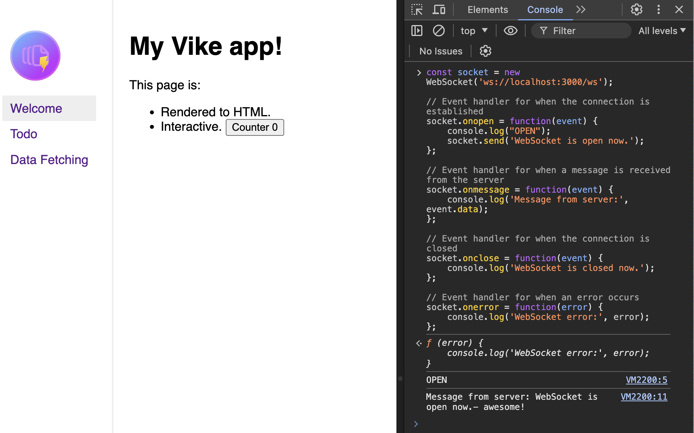

# Express, Vike, and Websockets

### Checklist to know it works:
- [x] The HMR works when you edit `+Page.tsx`
- [x] The WebSocket handler works when you make a request to it.



To test the websocket. Just go to the browser console with the app opened and paste this:

```ts
const socket = new WebSocket('ws://localhost:3000/ws');

// Event handler for when the connection is established
socket.onopen = function(event) {
    console.log("OPEN");
    socket.send('WebSocket is open now.');
};

// Event handler for when a message is received from the server
socket.onmessage = function(event) {
    console.log('Message from server:', event.data);
};

// Event handler for when the connection is closed
socket.onclose = function(event) {
    console.log('WebSocket is closed now.');
};

// Event handler for when an error occurs
socket.onerror = function(error) {
    console.log('WebSocket error:', error);
};
```

This app as scaffolded using [Bati](https://batijs.dev/)
```ts
pnpm create @batijs/app --react --express
```
